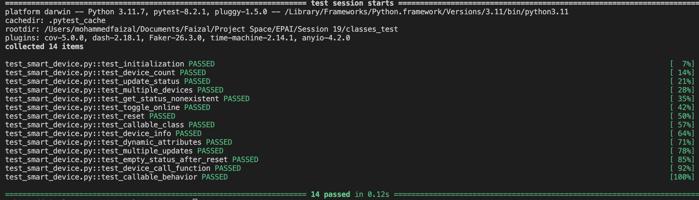

# Classes Part 1

This repository contains the implementation of the **SmartDevice** class and accompanying test cases using `pytest`. The **SmartDevice** class simulates the behavior of a smart device with various functionalities, making it a great demonstration of object-oriented programming principles.

---

## 📜 Problem Statement

The goal of this assignment is to create a Python class named `SmartDevice` that mimics a smart device's functionalities. It includes initialization, status management, and callable features, among others.

### Key Features:

1. **Initialization**:
   - Accepts `device_name`, `model_number`, and `is_online` (default: `False`).
   - Tracks the total number of devices created using a class attribute `device_count`.

2. **Attributes**:
   - `device_name`: The name of the device.
   - `model_number`: The model number of the device.
   - `is_online`: Boolean indicating the device's online status.
   - `status`: A dictionary storing the device's feature statuses.

3. **Methods**:
   - `update_status(attribute, value)`: Updates/creates a status attribute.
   - `get_status(attribute)`: Retrieves a specific status attribute or returns `'Attribute not found'`.
   - `toggle_online()`: Toggles the `is_online` attribute.
   - `reset()`: Resets the `status` dictionary to default values.

4. **Callable Class**:
   - Calling an instance returns a formatted string with `device_name` and `model_number`.

5. **Function Attribute**:
   - Includes a callable function `device_info` to fetch the device's current state.

---

## 🛠️ Files in This Repository

- **`smart_device.py`**: Contains the implementation of the `SmartDevice` class.
- **`test_smart_device.py`**: Contains test cases to validate the class functionality using `pytest`.

---


## ✅ Test Case Results

Below is a screenshot showing all the test cases passing successfully:



---

## 📂 Class Implementation

### Code Overview

```python
class SmartDevice:
    # Class attribute to track total number of devices
    device_count = 0

    def __init__(self, device_name: str, model_number: str):
        # Initializes the instance and class attributes
        ...

    def update_status(self, attribute: str, value: any):
        # Adds/updates a status attribute
        ...

    def get_status(self, attribute: str) -> any:
        # Retrieves a status attribute
        ...

    def toggle_online(self):
        # Toggles the online status
        ...

    def reset(self):
        # Resets all status attributes
        ...

    def __call__(self) -> str:
        # Returns formatted device information
        ...

    def __del__(self):
        # Decrements the device count when an instance is deleted
        ...
```

For the full implementation, see [`smart_device.py`](smart_device.py).

---

## 🧪 Test Cases

### Highlights
- **Initialization**: Validates attribute setup and `device_count`.
- **Status Management**: Tests `update_status`, `get_status`, and `reset`.
- **Behavior**: Checks online toggling, callable behavior, and dynamic attribute updates.

For detailed test cases, refer to [`test_smart_device.py`](test_smart_device.py).

---

## ✨ Features Demonstrated
- Object-Oriented Programming:
  - Initialization and encapsulation.
  - Use of class attributes and instance attributes.
  - Callable class behavior.
- Pythonic Principles:
  - `__call__` and `__del__` magic methods.
  - Dynamic method assignment.
